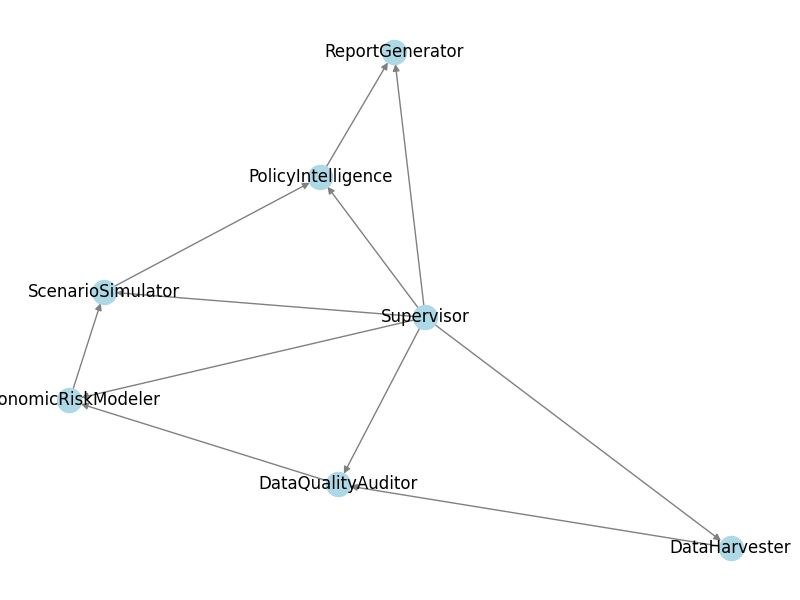

# SADC-Economic-Resilience-Monitor

> **Tags:** `SADC` `macroeconomics` `early-warning` `multi-agent` `policy` `resilience` `python` `data-quality` `scenario-analysis`

## Project Overview

Southern African Development Community (SADC) countries face recurring macro-fiscal risks and shocks. Policymakers require timely, explainable, and actionable early-warning insights to support financial stability and resilience.

This repository provides an automated, multi-agent system that monitors, audits, models, simulates, and reports on macro-fiscal risks for all 16 SADC countries. The system supports Ministries of Finance, Central Banks, and development partners by:

- Using modular Python agents for data harvesting, quality auditing, risk modeling, scenario simulation, policy intelligence, and report generation
- Integrating real World Bank/IMF data, robust data quality checks, explainable risk scoring, and advanced scenario simulation (Monte Carlo, Bayesian VAR, local projections)
- Producing concise, visually engaging policy briefs and dashboards, with clear data quality and policy recommendations

The result is a yearly, explainable, and actionable macro-fiscal risk assessment for each SADC country. This enables evidence-based policy dialogue and rapid response to emerging risks, with transparent data quality and scenario analysis.

---

### Agent Linkage Diagram

Below is a visual representation of how the agents interact in the system:

---

### Recent Achievements

- Automated generation and insertion of executive summaries using Ollama LLM, enforcing a strict structure (Risk Profile, Key Trends, Policy Implications, Conclusion)
- Data quality reports for all countries are now consolidated in a single file with clear section headers
- Robust scenario simulation and risk scoring for all SADC countries
- README and documentation updated for clarity and discoverability
- Visual agent linkage graph included for easy understanding of agent relationships

---
For more details, see [sample_test.py](sample_test.py) and the generated reports in the `reports/` directory.
